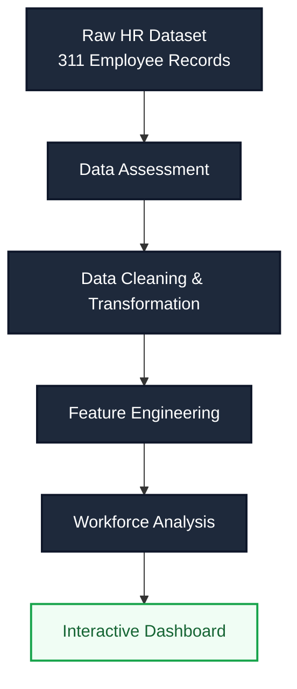
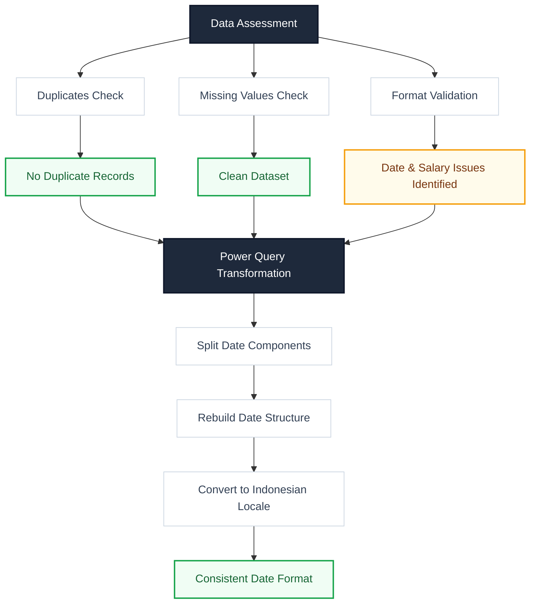
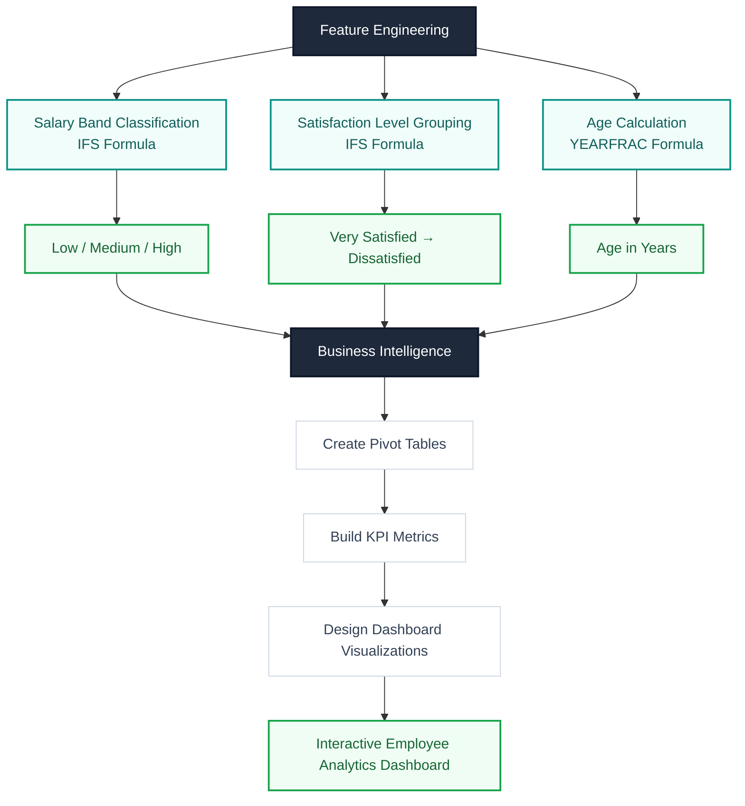

[← Back to Excel Projects](../README.md) | [Main Portfolio](../../README.md)

---

# HR Workforce Analysis — Excel & Power Query

**Dataset:** Human Resources Data Set | **Source:** Kaggle  
**Tool:** Microsoft Excel + Power Query  
**Project Type:** Data Cleaning, Workforce Analysis, Dashboarding

---

## Project Flow

This project followed a structured workflow starting from dataset assessment and validation, continuing through data transformation and feature engineering, and ending with workforce analysis and dashboard development.

### 1. Workflow



The workflow began with assessing the dataset for quality and consistency issues. After identifying formatting problems, the data was transformed and standardized in Power Query. Additional analytical features were then created to support workforce analysis, KPI calculation, and dashboard development.

### 2. Assessment & Transformation Workflow



This phase focused on validating data quality before making any changes. After identifying date formatting issues, Power Query was used to standardize and reconstruct date values to ensure consistency throughout the dataset.

### 3. Feature Engineering & Dashboard Workflow



After data preparation, several derived columns were created to support segmentation and analysis. These features were then used to build pivot tables, KPI metrics, and the final workforce analytics dashboard.

---

## What This Is

Okay so first time dealing with actual HR data. Like serious HR data. The dataset has employee information — demographics, salary, departments, managers, satisfaction, performance ratings, all that stuff.

Simple goal: clean the data, build some columns, make a dashboard.

What actually happened? A lot of wtf moments, a lot of going to Reddit at 2am, learning how to actually think through problems instead of just copying formulas from Stack Overflow and AI

This README is basically me documenting the whole mess. The confusing parts too. Not just the "here's the answer" parts.

---

## How I Imported The Data

Opened Excel. Blank spaces delimiter. Data → Text/CSV. Done.

Nothing fancy. Moving on.

---

# Phase 1 — Just Looking At The Data First

Before I touched anything, I just spent time looking. I wanted to understand what I was working with before deciding what's broken and what's just... normal.

---

## ManagerID Duplicates Check

First thing I noticed: `ManagerID` had bunch of same values repeating. My immediate thought was "oh shit someone duplicated the records."

Then I thought about it for like 5 seconds and realized... yeah, multiple people report to the same manager. That's how jobs work. Dumbass.

Also saw `Webster Butler` as a manager name. Saw `N/A-StillEmployed` in some columns. Looked sus at first. Then I checked — that's just how the system marked active employees. Not an error, just how the data was structured.

To actually check for full duplicates, I used **Conditional Formatting → Highlight Duplicate Cells**.

**Result:** Nothing. No duplicate employee records.

---

## Missing Data Check

Filtered through each column looking for blanks.

**Result:** Nothing major. Dataset was actually clean, which surprised me.

---

## Date And Salary Issues

Found two things:
- Dates were text, not actual dates
- Salary was just a number, not formatted

Checked for weird special characters using filtering. Checked for inconsistent formatting using Conditional Formatting.

**Result:** Nothing weird. Just those two type issues.

---

## Hidden Whitespace Check

Learned this one from research:

```excel
=A2<>TRIM(A2)
```

Used Conditional Formatting to highlight any cells with hidden spaces.

**Result:** Nothing.

---

# Phase 2 — The Date Format Shit That Broke My Brain

Okay so this section. This took way longer than it should have.

I opened the DOB column and saw `09/27/88`.

My brain went: **"Since when does a year have 27 months?"**

Took me longer than I want to admit to realize the dataset uses US format (MM/DD/YY) and I'm Indonesian so my brain reads DD/MM/YY automatically.

Dataset wasn't broken. I was just stupid about date formats. Okay moving on.

---

## First Try (That Didn't Work)

I did some research on Reddit, Excel forums, and AI explanations, and they all pointed me toward **Power Query**.

The funny thing is, this was my first time ever using Power Query. When I opened it, my immediate reaction was:

>*"Bruh, why does this feel like I'm sitting in an airplane cockpit?"*

There were buttons, menus, and features everywhere. It looked overwhelming at first.

After experimenting with it and following a few tutorials, I started to understand why it's such a popular tool for data cleaning and transformation.

I jumped into Power Query and tried:

```powerquery
Date.FromText([DOB], "en-US")
```

Some converted right. Some didn't. Thought I was done. I was not done.

---

## The Rabbit Hole

First things first: I had absolutely no clue what I was doing.

So I did what every developer, analyst, and Excel survivor does—I researched. Then I researched some more. And then some more.

Somewhere along the way, I fell deep into the rabbit hole.

Eventually, I found a gem: Ken Puls' ExcelGuru article, *"Fix Date Errors"* (2015).

When I saw the publication date, my first thought was:

> *"Bruh, this article is older than my Excel skills."*

Yet somehow, it contained exactly the explanation I needed.

According to Ken, 
> many systems export dates using the US format (**MM/DD/YYYY**). When those dates are imported into a system configured with a different regional setting, Excel may interpret them incorrectly.
[1](https://excelguru.ca/fix-date-errors/#:~:text=The%20problem%20comes,Jan%2012%2C%202000.) 


Basically Excel was trying to be smart about parsing the date and just guessed wrong.

Shout-out to Yoda.

## So Why This Failed?

Take `07/10/83`. 

- Is that July 10th?

- Or October 7th?

When both numbers are ≤ 12, Excel can't tell which is which. So it guesses. Sometimes wrong.
I got inconsistent results and had no fucking clue why at first, spent way too long on this shit.

Knew why it was breaking now. Still had no idea how to fix it.

---

## Another Rabbit Hole

At this point, I knew *why* the dates were breaking.

I still didn't know how to fix them reliably.

So I kept digging.

More Reddit threads.

More forum posts.

More experiments.

More moments of staring at Power Query wondering if I had accidentally enrolled in an aviation training program.

Eventually, I stumbled across another gem on Reddit: **"Turn 090523 text into 9/5/23 date in Power Query."**

While reading through the discussion, one comment caught my attention. It was posted by a user named ***workonlyreddit***.


[source img](https://www.reddit.com/r/excel/comments/1d1e1fz/comment/l5tau7q/?utm_source=share&utm_medium=web3x&utm_name=web3xcss&utm_term=1&utm_content=share_button) 

Another ancient post.

Another Yoda.

The idea was simple:

> Stop letting Power Query guess what the date means. Split the value into separate pieces and rebuild the date manually.

That was the breakthrough.

## Then How i Fixed it?

Instead of relying on automatic date parsing, I explicitly told Power Query which number represented the month, day, and year Manually.

**Step 1:** Split DOB by `/` into three columns → `DOB.1`, `DOB.2`, `DOB.3`

**Step 2:** Convert to text

**Step 3:** Rebuild manually with custom column:

```powerquery
#date(
    Number.FromText("19" & [DOB.3]),
    Number.FromText([DOB.1]),
    Number.FromText([DOB.2])
)
```

The `#date()` function builds a date using:

```text
Year, Month, Day
```
By splitting the values first and rebuilding them manually, there is no ambiguity. Power Query no longer has to guess whether `07/10/83` means July 10th or October 7th.

I am explicitly telling it:

- This is the year.
- This is the month.
- This is the day.


**Step 4:** Change the resulting column type using the Indonesian locale

**Result:** Every date came out DD/MM/YYYY. Consistent. Finally. After hours of research, testing, and questioning my life choices, the solution turned out to be surprisingly simple.

---

# Phase 3 — Derived Columns (The Thinking Part)

After cleaning, I needed columns that actually make sense for analysis.

---

## Salary Band

Segmented salaries into categories. Used IFS:

```excel
=IFS([@Salary]<50000;"Low";[@Salary]<70000;"Medium";TRUE;"High")
```

How it works: Excel checks top to bottom. Stops as soon as one matches.

Salary under 50k? → **Low**, done. Doesn't check the rest.  
Not under 50k but under 70k? → **Medium**, done.  
Doesn't match anything? → **High**.

*[beginner to beginner]*

Why doesn't 49k show as Medium even though it's also <70k? Because it already matched the first rule and stopped there.
Think of it like a delivery tracking system. Once your order reaches point B, the app stops tracking. It doesn't keep going to point C.
The `TRUE` at the end just means "everything else that didn't match above."

---

## Satisfaction Level

Same logic, applied to satisfaction scores:

```excel
=IFS(
  [@EmpSatisfaction]=5;"Very Satisfied";
  [@EmpSatisfaction]=4;"Satisfied";
  [@EmpSatisfaction]=3;"Neutral";
  TRUE;"Dissatisfied"
)
```

---

## Satisfaction Score (Numbers)

After creating the text labels, I realized something: **you can't average text values.**

So I made another column that converts text to numbers:

| Satisfaction Level | Score |
|--------------------|-------|
| Dissatisfied | 1 |
| Neutral | 2 |
| Satisfied | 3 |
| Very Satisfied | 4 |

Used `SWITCH()` and `INT()` to convert. Now I could actually calculate averages and build dashboard metrics.

---

## Age — The Confusing Part

Here's the thing: First time working with HR data. Didn't even know what DOB meant. Like I'm looking at this dataset going "what is this abbreviation?" So I researched what it meant before doing anything else.

DOB = Date of Birth. Okay. Cool.

Now: I have dates of birth. How do I turn that into age?

Researched Reddit, Quora, forums. Everyone said use `DATEDIF()`.

**You know what's funny?** My Excel didn't even have the `DATEDIF()` function.

At that point, I was annoyed.

I wanted someone to blame.
I wanted to blame Microsoft, Then Windows, Then Linux, Then Linus Torvalds, Then Apple, Then Samsung, Then SpaceX.

I was running out of targets.

Then I thought about blaming my number one enemy—the thing I'm always ready to complain about:

my gov—

Whoa, whoa, whoa. that's too far.

i love my goverment.

The point is, I was convinced something had to be broken. My Office installation, my Excel version, my laptop, the alignment of the planets—anything except the possibility that I was simply looking at the dates wrong.

And i do More research and Found `INT()` + `YEARFRAC()` combo:

```excel
=INT(YEARFRAC([@DOB];TODAY();1))
```

Breaking it down:
- `YEARFRAC` calculates year difference as a decimal. Like `42.7` years.
- `INT` strips the decimal. So `42`.
- `TODAY()` = I don't hardcode a date. It just always uses today.
- The `1` at the end = day count convention. `1` = Actual/Actual (DD/MM/YY). `0` = US format. After everything I went through with US date shit, I chose `1`.

Tested with DOB `10/07/1983` → got **42**. Correct.

`INT` and `YEARFRAC` were both new to me. Not complicated once you understand what each part does.

---

# Phase 4 — Pivot Tables & Dashboard

This part was actually chill after the date format nightmare.

By now the hard work was done. Data cleaned, columns built, everything typed correctly. Pivot Tables just summarize what's there — they don't fix anything.

Used them to look at:
- Employee status distribution
- Age groups
- Departments and positions
- Managers
- Salary segments
- Satisfaction levels

### The Numbers

| KPI | Value |
|-----|-------|
| Total Employees | 311 |
| Active | 207 |
| Voluntarily Quit | 88 |
| Fired | 16 |
| Average Salary | 69,020.68 |

<!-- dashboard screenshot goes here -->

---

# What I Learned From This

- **Repeated values ≠ duplicates.** Check before assuming.
- **Validate first, clean second.** Understanding data before fixing it matters.
- **Date localization is real.** Systems built in different countries read dates differently. Automatic conversion fails on ambiguous dates.
- **Power Query is worth it.** Looks overwhelming at first but it's more reliable than trying to fix everything in the sheet.
- **Research is literally part of the job.** Reddit, forums, documentation, AI — that's normal. Not cheating.
- **Pivot Tables only summarize.** Dashboard quality depends on how good your cleaning was. That's it.

---

## Real Talk

Basically: Open Excel → Apply Formula → Done, that's not what this job is. It's more like: look at data → understand it → find weird shit → research why → fix it properly → then analyze.

Sometimes the "fix" is realizing the data isn't actually broken, you just need an internet connection and a bit of patience to actually look.

---

*Created by Cool person while learning Excel and Power Query. Dataset from Kaggle. Learned way more than expected.*

*Source Dataset*
[Kaggle](https://www.kaggle.com/datasets/rhuebner/human-resources-data-set)

---

[← Back to Excel Projects](../README.md) | [Main Portfolio](../../README.md)
